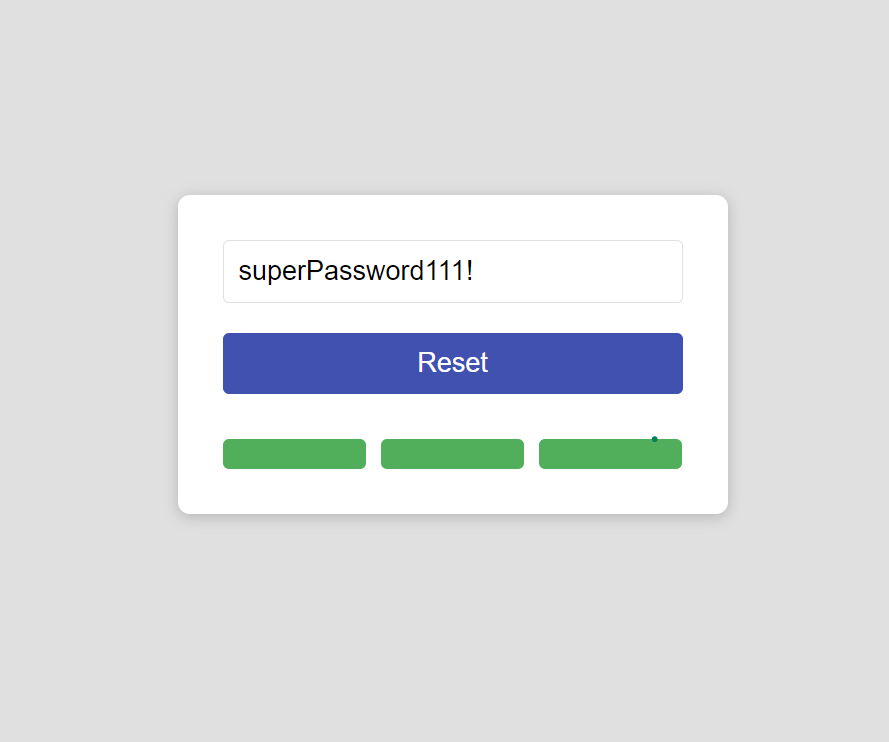

# Password-Checking-Form

Це форма, написана на TypeScript та React, яка дозволяє в реальному часі показувати індикацію міцності вашого супер паролю. Дизайн схожий на  Material UI, але я не використовував саму лібу, бо не хотів додавати великі бібліотеки для простого додатка.

## Скріншот

## Велике дякую

Велике дякую всім, хто переглядає цей проект. Ваша увага дуже цінна!

---

# Password-Checking-Form

This is a form, written in TypeScript and React, that allows you to show the strength indication of a password in real time. The design was inspired by Material UI, but I didn't use it because I didn't want to add large libraries for a simple application.

## Big Thank You

The biggest thank you to everyone who views this project. Your attention is very valuable!
